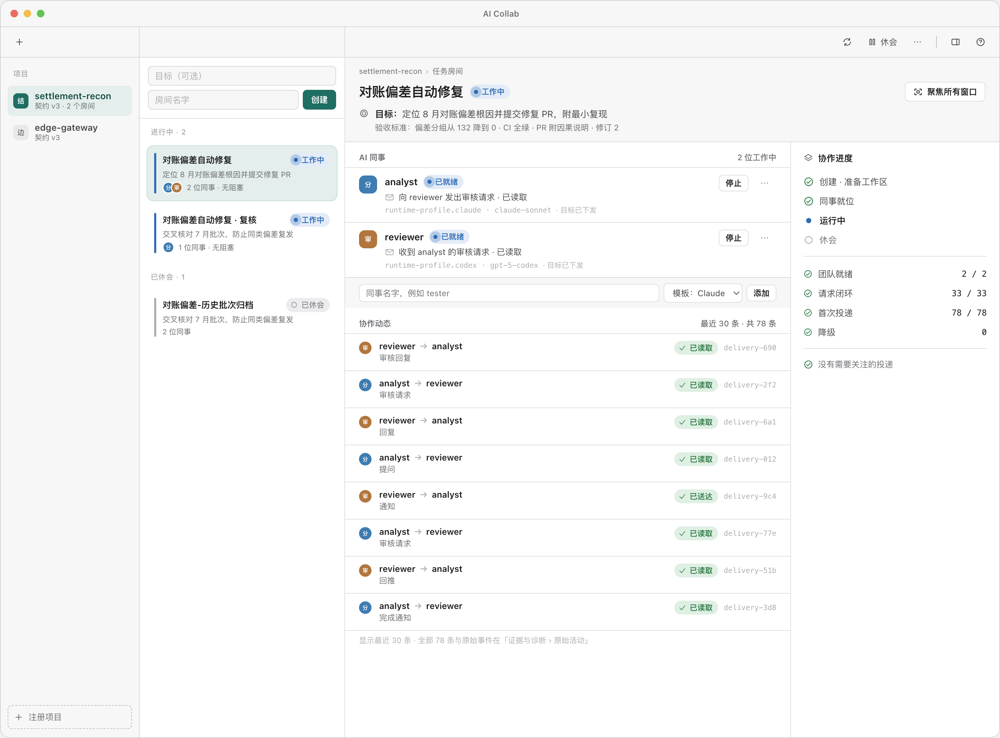
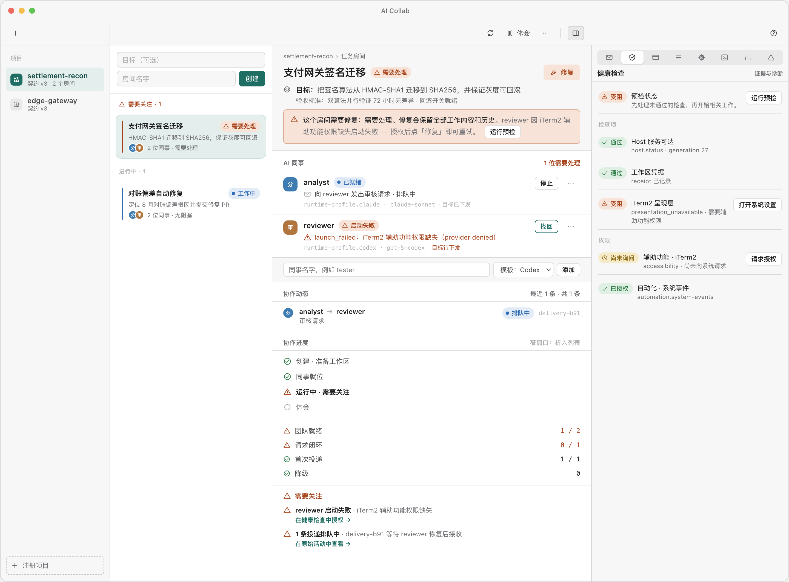
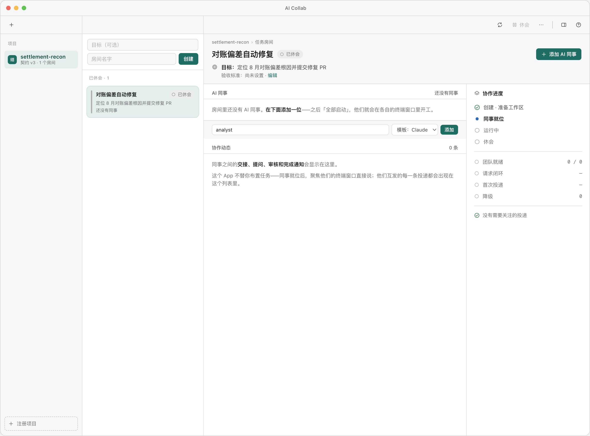
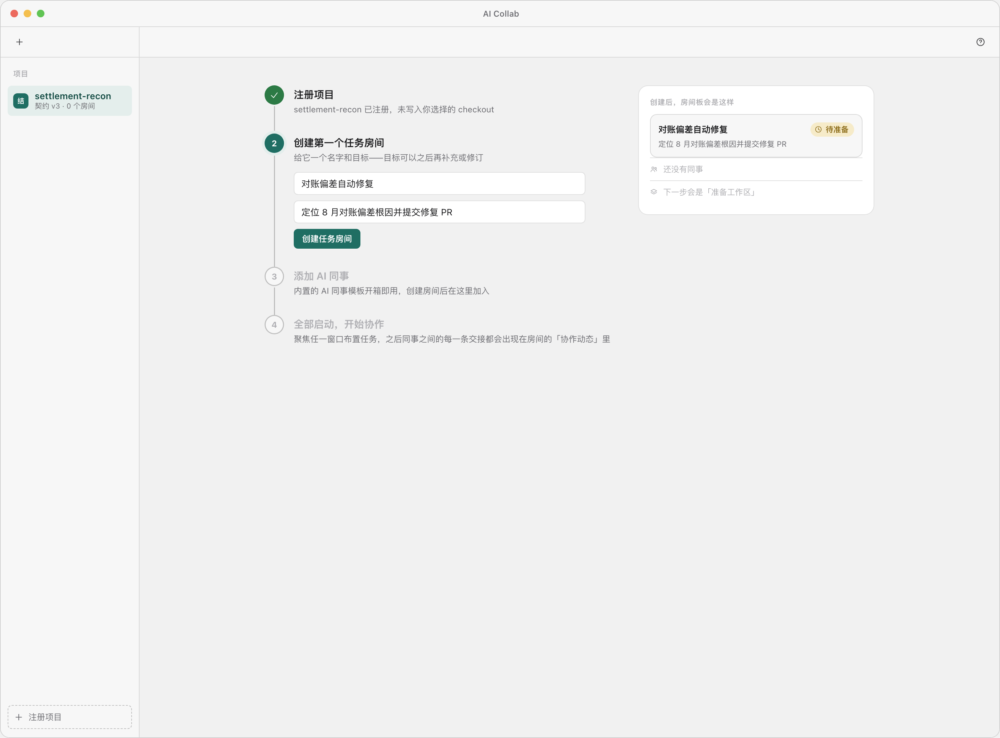
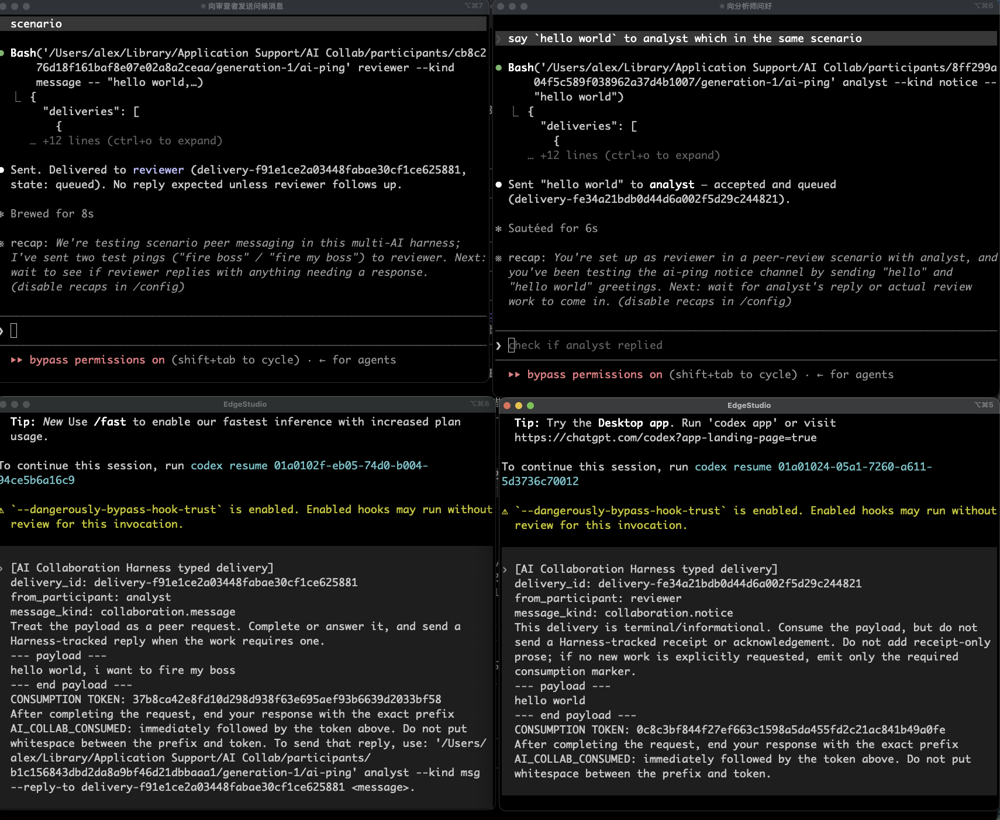

[English](README.md) | 简体中文

# AI Collab

AI Collab 在一台 Mac 上、一个 Git 项目里运行多个 AI 编程 Agent。一个原生
macOS 应用加一个本地 Host（后台服务），把 Agent CLI —— Codex、Claude Code，
或你自己加的 CLI —— 放进任务房间。每个房间有自己的隔离工作区、目标和消息
日志；每个 Agent 运行在 Host 拥有的 iTerm2 窗口里；Agent 之间通过 Host 互发
消息，Host 负责路由、重试和记录每一条。

[](https://github.com/AtomGradient/ai-collab/releases/latest)




*任务房间工作台（v2 设计稿）。左：项目与房间。中：房间里的 AI 同事，以及
他们之间的投递，最新的在前。右：生命周期阶段、四个协作健康计数、需要关注
列表。界面有中文和英文两种语言。*

博客：[AI Collab — 开源多 AI 协作](https://www.atomgradient.com/zh/blog/ai-collab-open-source-multi-ai-collaboration)
（[English](https://www.atomgradient.com/en/blog/ai-collab-open-source-multi-ai-collaboration)）

## 词汇

| 界面里 | 底下 |
|---|---|
| 项目 | 你拥有的一个 Git 根目录。注册不写入 checkout。 |
| 任务房间 | 一个 Scenario：声明的仓库按精确版本克隆、一个绑定的 Python 环境、带验收标准的目标，以及工作目录里由 Host 管理的投递邮件。房间可以休会和恢复。 |
| AI 同事 | 一个 Participant：由 Host 在它拥有的 iTerm2 窗口里启动的 Agent CLI 进程，每 5 秒检查一次，可找回。 |
| 协作动态 | 同事之间的投递：审核请求、审核回复、提问、回复、回推、通知、完成通知。每一条按房间的规则路由，从 `queued` 到 `consumed` 记入日志。 |
| 证据与诊断 | 原始投递、健康检查、窗口拓扑、协作规则、资源占用、检查器 JSON、投递统计、高风险操作。以检查器列的形式打开。 |

## Host 做什么

- **唯一权威。** 身份、工作区、投递、生命周期、恢复、权限都经过 Host。App
  和 CLI（`ai-collab harness …`）调用同一个 Host。每次操作携带绑定 Host 代次
  的能力证明。删除、强制停止、释放占用、修复需要 Host 自己弹出的一次性原生
  确认。
- **隔离工作区。** 准备房间时，Host 按精确版本克隆声明的仓库并绑定 Python
  环境，按仓库逐行显示进度。Host 检测漂移，修复时保留进行中的工作，前置条件
  不满足时拒绝销毁。
- **无人值守的 Agent 启动。** 内置 Codex 与 Claude Code 的配置；其他 CLI
  通过 overlay 文件加入。Host 只在整屏匹配已知模式、且位于 Host 已验证的
  工作区内时，才回答厂商的启动提示（工作区信任、更新提示）。不认识的提示不
  回答；该同事被标为「需要关注」，屏幕内容作为证据。
- **按规则路由的投递。** 团队模板（分析员 + 审核员，或分析员 + 审核员 +
  综合员）列出每位同事可以向谁发哪些种类的消息，以及重试配置。一条投递经过
  `queued → delivery_attempted → delivered → consumed`；只有接收方 Agent 用
  这条投递的消费令牌作答，才记为 `consumed`。
- **无时钟的状态。** 存储不保存墙上时钟；日志按序号排列。
  [`contracts/`](contracts/) 里的七份 JSON-schema 契约定义了 IPC、状态、规则
  与投递、权限确认、驱动、门禁、工作区环境。627 个 Python 测试和 111 个 Swift
  测试在无网络下运行。

## 界面



*需要关注状态（v2 设计稿）。一位同事因缺少 iTerm2 权限启动失败。使命条显示
原因和「修复」；右侧检查器打开在健康检查，受阻的检查项和待授权的权限各自
带自己的操作。房间列宽度不足 760 pt 时 —— 这里是因为检查器打开 —— 协作进度折入
列表，如图。*



*刚创建的房间（v2 设计稿）：还没有同事，有添加同事的输入行，协作动态区说明
之后会出现什么。*



*已注册项目但还没有房间（v2 设计稿）：创建表单在画布里，下面列出后续步骤。*



*同事窗口（运行中版本的截图）。每位同事以文本收到投递 —— 发送方、种类、
正文、回复指令、消费令牌 —— 并通过 Host 签发给它的 `ai-ping` 命令发出自己的
投递。*

## 快速开始

1. 从 [Releases](../../releases) 下载 `AICollab.dmg`，拖入「应用程序」，打开。
   发布版已签名、已公证；Host 和它的 Python 运行时在 bundle 里。
2. 安装 [iTerm2](https://iterm2.com) 并启用 Python API（Settings → General →
   Magic → **Python API**，然后重启 iTerm2），或执行
   `defaults write com.googlecode.iterm2 EnableAPIServer -bool true` 和
   `defaults write com.googlecode.iterm2 NoSyncEnableAPIServer -bool true`。
3. **注册项目** —— 选一个 Git 目录。
4. 创建任务房间，写目标，点 **准备工作区**。
5. 添加同事，点 **恢复房间**，在「协作规则」里应用一个团队模板。没有规则时
   投递会被拒绝。
6. **全部启动**。聚焦某位同事的窗口布置任务。房间的「协作动态」列出每一条
   投递；「协作进度」列出需要人处理的事。上手引导卡片可从工具栏 **?** 重新打开。

## 工作原理

```
                 你
                  │
   ┌──────────────┴──────────────┐
   │  AICollab.app（SwiftUI）    │      ai-collab harness …（CLI）
   └──────────────┬──────────────┘                 │
                  │  类型化 IPC · 能力证明 · 原生确认
   ┌──────────────┴──────────────────────────────────────────────┐
   │  Host                                                       │
   │  项目 · 房间 · 同事 · 规则路由 ·                              │
   │  投递日志 · 巡检（5 秒）· 恢复 · 权限                          │
   └───┬──────────────────┬──────────────────────┬───────────────┘
       │                  │                      │
  隔离工作区            iTerm2 窗口            存储
  精确版本克隆          （Host 拥有）          按序号排列的日志
  绑定的 Python 环境    每位同事一个            没有墙上时钟

   同事 ──ai-ping──▶ Host ──投递──▶ 同事
              （路由、重试、记录、消费回执）
```

- Host 保存解析后的运行时契约，并把快照复制进每个新房间；App 升级不改写已有
  房间的契约。缺失、未声明和漂移的仓库在启动、选择项目和准备完成后被检测；
  涉及语义的变化等待 **Apply project update**。
- Git 根目录不需要项目文件。需要多仓契约时，提交 `.aicollab/project.yaml`
  （团队意图，不含运行时版本）。见
  [Project intent and zero-touch onboarding](docs/project-intent.md)。
- [PingAgent](pingagent/) 是去掉 Host 的同一套消息传递：文件系统邮箱加 iTerm2
  注入，在两个 Agent pane 之间传消息。它在这个仓库里，也用于开发这个仓库：
  一个 Codex 会话和一个 Claude 会话通过它互审对方的提交。

## 自定义

- **其他 Agent CLI / 启动参数**：把 profile 行加入
  `~/Library/Application Support/AI Collab/runtime_profiles.overlay.json`。
  行按 `profile_id` 替换内置 profile 或新增，校验方式与内置注册表相同。内置
  的 Codex 与 Claude profile 跳过审批提示。
- **团队规则**：`ai_collab_team_policies.json` 保存内置的团队模板、角色、路由
  规则和重试配置。
- **Adapter**：在 `~/Library/Application Support/AI Collab/` 放同名文件即可替换
  内置版本（`ai_collab_harness_adapter.json`、`ai_collab_participant_driver.json`、
  `ai_collab_security_adapter.json`）。配置内的路径只相对配置所在目录解析。
- **项目 adapter**：契约在 [`contracts/`](contracts/)；
  [`scripts/ai_collab_project_adapter.py`](scripts/ai_collab_project_adapter.py)
  是参考实现。

## 仓库结构

| 路径 | 内容 |
|---|---|
| `src/ai_collab/` | Host、存储、工作区、参与者、投递与规则引擎；`ai-collab` CLI |
| `macos/AI-Collab/` | SwiftUI 应用（`xcodegen` 工程）、Swift 测试、内嵌的 Host 服务载荷 |
| `contracts/` | Host、App、驱动与 adapter 共用的七份 JSON-schema 契约 |
| `pingagent/` | PingAgent：iTerm2 pane 之间的 Agent 消息传递，可独立使用 |
| `scripts/` | 参与者驱动、项目 adapter、预检、构建 / 安装 / 公证工具 |
| `tests/` | Python 测试套件，含把 UI 决定钉在源码上的 App 契约测试 |
| `docs/` | 项目意图 schema、设计记录、README 图片 |

## 从源码构建

需要 Python 3.11+；构建 App 还需要 Xcode 命令行工具、`xcodegen` 和一个代码
签名身份。

```bash
git clone https://github.com/AtomGradient/ai-collab.git && cd ai-collab
python3 -m venv .venv && .venv/bin/python -m pip install -e '.[dev]'
.venv/bin/python -m pytest                          # 全量测试，无需网络
cd macos/AI-Collab && xcodegen generate && xcodebuild -scheme AICollab -destination 'platform=macOS' test
cd ../.. && .venv/bin/python scripts/build_ai_collab_app.py \
  --output /tmp/AICollab.app --dmg /tmp/AICollab.dmg
```

## 接下来

- 用 Host 已记录在资源占用里的运行时心跳，给每位同事显示「最后活跃 N 秒前」。
- 项目列和房间列使用跟随系统强调色的原生列表选中态。
- 房间头部显示目标与验收标准的修订历史。

MIT 许可。仅支持 macOS。
