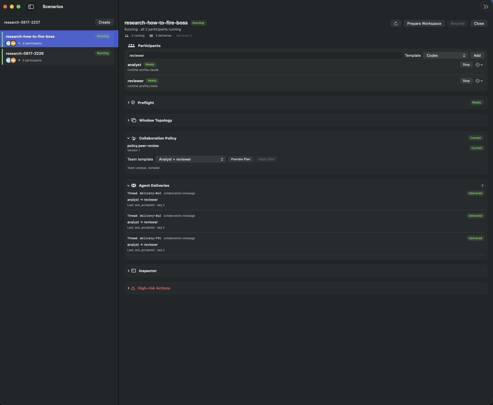
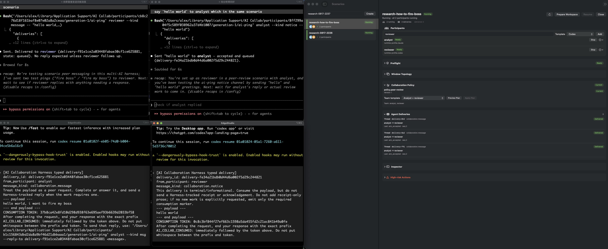

[English](README.md) | 简体中文

# AI Collab

macOS 上的本地多 Agent Scenario 协作套件。把任何 Git 项目变成可长期保存的
任务房间：多个 AI Agent 在各自隔离的工作区里干活，并通过一个类型化、可审计
的 Host 相互通信。



四个 Agent 分属两个 Scenario，通过 Host 互发消息、互不干扰：



## 快速开始

1. 从 [Releases](../../releases) 下载 `AICollab.dmg`，拖入「应用程序」。
   首次启动：右键 → **打开**（已签名，未公证）。
2. 安装 [iTerm2](https://iterm2.com) —— Agent 运行在由 Host 拥有并可恢复的
   iTerm2 窗口里。
3. 点击 **Register Project**，选择任意 Git 目录。如果这个项目从未接入过
   AI Collab，App 会根据目录里找到的仓库自动起草声明文件，一步完成注册。
4. 创建一个 Scenario，添加参与者（Codex 与 Claude CLI 的配置开箱即用），
   它们立刻就能互发消息 —— 每个参与者都会拿到一份由 Host 签发的专属
   `ai-ping` 命令。

## 工作原理

- **Host** 是唯一权威：身份、隔离工作区、消息投递、生命周期、恢复与权限
  全部经过它。App 和 CLI（`ai-collab harness …`）只是同一个 Host 的两个
  入口。
- 项目用根目录下的四个小文件描述自己（`project_descriptor.yaml`、
  `repo_manifest.yaml`、门禁登记表和协作模板）。App 会替你起草；想改变
  Scenario 的装配内容，编辑后重新注册即可。
- 每个 Scenario 都会拿到所声明仓库的精确版本克隆和一个绑定的 Python
  环境，带漂移检测、保留 WIP 的修复和 fail-closed 销毁。

## 自定义

- **Agent 启动参数 / 其他 CLI**：把完整的 profile 行写入
  `~/Library/Application Support/AI Collab/runtime_profiles.overlay.json`。
  行按 `profile_id` 替换内置 profile 或新增，校验标准与内置注册表完全
  一致。（内置的 Codex/Claude profile 有意跳过审批提示 —— 为了无人值守
  协作。）
- **Adapter**：在 `~/Library/Application Support/AI Collab/` 放同名配置
  即可替换内置版本（`ai_collab_harness_adapter.json`、
  `ai_collab_participant_driver.json`、`ai_collab_security_adapter.json`）。
  配置内的路径只能相对配置所在目录解析 —— 正是这条限制防止 Host 被指向
  任意程序。
- **自己写项目 adapter**：机器可读的契约在 `contracts/`；
  `scripts/ai_collab_project_adapter.py` 是一份完整的参考实现。

## 从源码构建

需要 Python 3.11+；构建 App 还需要 Xcode 命令行工具、`xcodegen` 和一个
代码签名身份：

```bash
git clone https://github.com/AtomGradient/ai-collab.git && cd ai-collab
python3 -m venv .venv && .venv/bin/python -m pip install -e '.[dev]'
.venv/bin/python -m pytest                          # 全量测试，无需网络
.venv/bin/python scripts/build_ai_collab_app.py \
  --output /tmp/AICollab.app --dmg /tmp/AICollab.dmg
```

MIT 许可。仅支持 macOS。
